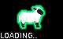

# Shepherd

A small game about a shepherd and his flock of sheep.

## Packages and Compiling

This game uses SDL2 and SDL2_Mixer as dependencies. To install these packages on Debian, run
`$ sudo apt install libsdl2-dev libsdl2-mixer-dev`

The game compiles with a [Makefile](Makefile). Run the make file by typing `$ make`

Once the game is compiled, run it with `$ make run`

Commands `$ make clean`, `$ make debug`, and `$ make debug-mem` are also available for cleaning the build, debugging, and checking memory management respectively.

## Gameplay

Solve ancient puzzles and fend off wolves as you lead your sheep to greener pastures.

Note that this game is a work-in-progress, only providing about 5-15 minutes of gameplay for the time being.

Games cannot be saved for the time being, but this will hopefully be a feature in the future.

### Controls
There is a tutorial in place that should give you the basic controls and instruct you on how to play.

Press Escape to open the pause menu, and F11 to toggle fullscreen. Menus can be navigated with both WASD and Arrow Keys.

# Editing

## Level Editing

Level files can be located within [Assets > Maps](Assets/Maps), and are merely comprised of ASCII.
The translations of char to tile/entity can be found within [Map > map_loading.cpp](src/Map/map_loading.cpp) in the bottom function.
The number and letter below the actual map tiles itself are used for level identification and biome. Biomes merely affect the background color, whereas the identification is used in [Triggers](src/Triggers) to tell what level is what.

Below the level identification section is lines that can be used for **scrolls**. Scrolls are special collectibles that can contain various, meaningful text.
The first line after map identification is the name of the scroll. This is what you see when browsing discovered scrolls in the pause menu.
The line below the scroll name is the text the scroll contains when read. It extends the remaining length of the file, just note it has a max length of 256 characters (set in [config.h](src/Core/config.h)) and all the text must be able to fit in the dialogue box at once.

## Triggers and Puzzles

If you want to set up and configure a puzzle, simply edit the function [Trigger_SetupPuzzles](src/Triggers/triggers.cpp) and add a section for your added level. Note the use of the [Puzzle](src/Map/puzzle.h) struct, which is a general, easy-to-use interface for creating puzzle conditions.
If the level requires a unique set of inputs, you can add conditions in [Scripts::PuzzleInput](src/Triggers/scripts_puzzleinput.h) for more specific purposes.

There are also additional functions for unique timings and scenarios, such as Trigger_LevelLoaded (fires upon entering level), Trigger_StaffSwing (fires whenever staff is swung), Trigger_Idled (fires after `TicksUntilIdle` ticks have passed), Trigger_LevelEvent (when level's event timer reaches zero), and [Scripts::OnTile](src/Triggers/scripts_ontile.h).

## Custom Entities

Entities are located in the [Entities > Subclasses](src/Entities/Subclasses) folder. They all inherit the Entity class as somewhat of an interface, but contain custom functionality, drawing calls, and interactions.

Entities are managed a little messily right now, but may be cleaned up in the future. First, to register an entity, add their name and corresponding ID to the [EntityID enum](src/Core/enums.h). Make sure to set their ID in their class constructor.

All Entities have their Tick function called, but if you need certain behaviors that interact with other entities, like Fireballs bursting or a custom AI, you will likely have to add it in the main game loop, located in [main](src/Core/main.cpp), currently at around line 383 at time of writing. If it's an enemy, you may find the [AI Manager](src/Entities/ai_manager.h) more useful, letting you write lengthy functions without filling up `main.cpp`, and providing support for things like swarm targets (or `enemyGoal` as defined in the manager).

If you want to spawn your enemy using the Level's ASCII tileset, you can edit the [GenerateMapFromFile](src/Map/map_loading.cpp) function and specify a specific ASCII character for your Entity. Otherwise, you can spawn them with [Triggers](#Triggers).

Don't forget to set up a drawing function--use the other entities as examples. A function does not need to be defined if you are just using a plain image, like the Crate. Images are currently loaded in the Constructor for [RenderWindow](src/Core/renderwindow.h), deallocated in the Close function, and passed to entities in the DrawEntity function. If you're just drawing with SDL calls, a texture does not need to be provided (so no modification of RenderWindow is needed).